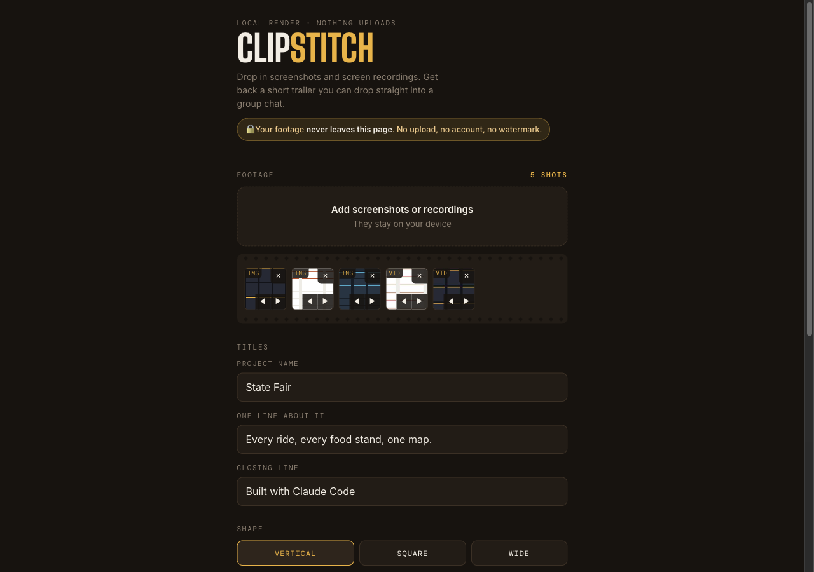

# Clip Stitch

Turn a pile of screenshots and screen recordings into a short trailer that looks like a launch video - entirely in your browser. Nothing uploads anywhere. Works on a phone.

**▶︎ Live: [clip-stitch.vercel.app](https://clip-stitch.vercel.app)**



**Everything happens in your browser.** Your footage never leaves the page, the video is drawn frame by frame on your own device, and the finished file is handed straight back to you. You can turn off wifi after the first load and it still works. The whole thing is ~3 small files you can read yourself.

## Why this exists

The polished-demo-video category is dominated by paid desktop apps - Kite is $40/month for a Mac app with a watermarked free tier, FocuSee and Screen Studio sell licenses (pricing as of August 2026). They are excellent, and if you make demo videos for a living you should buy one. Clip Stitch is the free corner of that market: no download, no account, no watermark, and it runs on the phone where your screenshots already live. Built as a companion to [Pic Shrink](https://github.com/aidenfyf/pic-shrink): one static page, no build step, no backend.

## What it does

You add footage, type a project name and one line about it, pick a shape and a look, and tap Make trailer. It assembles a kinetic title card, stages every shot the way the paid tools do - portrait shots get a phone body, wide shots get a browser window, each with a smooth eased push toward the action - adds a closing card, mixes in a music bed, and hands back an mp4.

Output lands around 3 to 15 MB for a typical 20 to 30 second trailer, which drops into a group chat without getting mangled.

## How it works

| Stage | Method |
|---|---|
| Compositing | Canvas 2D, one draw pass per frame |
| Timing | `requestAnimationFrame` against `performance.now()` |
| Encoding | `canvas.captureStream(30)` into `MediaRecorder` |
| Music | WebAudio oscillators, generated at render time |
| Sharing | Web Share API with a file, falls back to download |

Rendering is real time. A 25 second trailer takes about 25 seconds. Keep the tab in the foreground and the screen awake.

No `ffmpeg.wasm`, no `SharedArrayBuffer`, no cross-origin isolation headers. That is deliberate: it means the page runs on Vercel, GitHub Pages, Netlify, or a folder on your desktop with equal success, and it works in Safari on iOS.

## Privacy

- No upload. No backend. No analytics. No cookies.
- No dependencies - zero third-party code, fonts self-hosted.
- Open `app.js` and confirm: there is no `fetch`, no `XMLHttpRequest`, no network call of any kind.

## Run it

```bash
# just open it
open index.html

# or serve it (the service worker wants http/https)
python3 -m http.server 8080
```

No build step. Deploy by dropping the folder on any static host.

## Install on your phone

Open the live URL in Safari, tap Share, then Add to Home Screen. It opens full screen with no browser chrome and works offline after the first load.

From there you can hit Add screenshots or recordings and pull straight from your camera roll, including screen recordings you just took.

## Looks

Four presets, each defining background, text color, accent, shadow, and frame rim.

- **Spotlight** - warm radial dark, amber accent
- **Paper** - off-white, rust accent, for light UI screenshots
- **Dusk** - indigo to plum gradient, violet accent
- **Blueprint** - slate with a faint grid, cyan accent

Add your own in the `LOOKS` object near the top of `app.js`. A look is a `paint(ctx, W, H)` function plus four colors.

## Timing

Constants sit at the top of `app.js` if you want a different rhythm.

```js
const IMAGE_BEAT = 2.6;   // seconds per screenshot
const VIDEO_MAX  = 3.8;   // longest a single clip runs
const VIDEO_MIN  = 1.4;
const INTRO      = 2.3;
const OUTRO      = 2.4;
const SETTLE     = 0.34;  // entrance ease on each shot
```

Clips longer than `VIDEO_MAX` play their first few seconds. Record short takes rather than trimming later.

## Capture tips

These matter more than any setting in the app.

- One beat per file. Six short clips beat one long one.
- Keep the action in the middle of the screen. The push-in crops the edges.
- Pause a beat before every click so the motion reads as deliberate.
- Turn on Do Not Disturb and clear the menu bar before recording.
- Use realistic data. Nothing deflates a demo like `test test 123`.

## Format notes

Safari records mp4 with h264. Chrome will usually take mp4 too, and falls back to webm. The file extension follows whatever the browser actually produced, so a webm result is still valid, just less friendly to iMessage.

## Known limits

- Real-time render, so long trailers take a while.
- Very large 4K clips can stutter on older phones. Ten or fewer shots is a comfortable ceiling.
- Video thumbnails on the strip need a decodable first frame; some codecs will show a blank tile, which is cosmetic only.

## Files

| File | What it is |
|---|---|
| `index.html` | The page |
| `style.css` | All styling, OKLCH tokens, no framework |
| `app.js` | All logic: timeline, canvas render, recorder, music |
| `sw.js` | Service worker for offline + install |
| `fonts/` | Big Shoulders Display, Inter, DM Mono (SIL OFL 1.1) |

## License

[MIT](LICENSE) © 2026 Aiden Frazier - do whatever you like, just keep the notice. (Bundled fonts are SIL OFL 1.1.)
